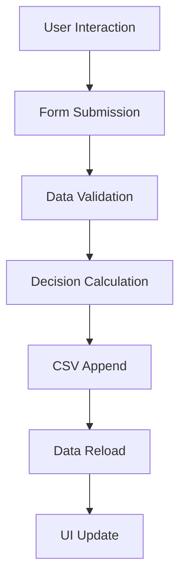
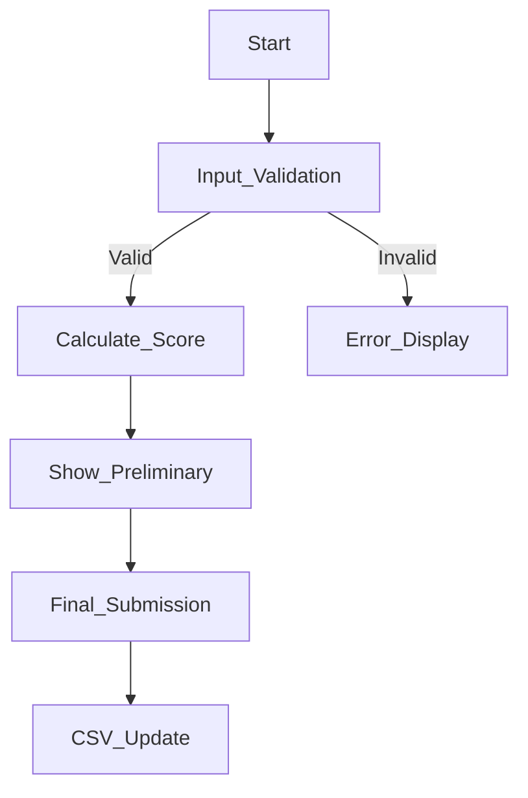

# Architecture & Logic of the TradeSphere Connect Application

## 1. Initialization Phase
**When the application starts:**

**Session Setup:**
- Checks if a user is logged in (auto-login for demo)
- Initializes `st.session_state` to store user data and application state

**File System Check:**
- Looks for `supplier_data.csv` in the working directory
- If file doesn't exist:
  - Creates a new CSV with 2 demo supplier entries
  - Establishes all required columns (14 fields including decision metrics)
- If file exists but is corrupted/empty:
  - Creates an empty DataFrame with correct column structure

**UI Framework Setup:**
- Configures Streamlit's page layout (wide mode)
- Prepares the navigation sidebar with 4 sections

---

## 2. Data Flow
**Core data operations:**



**Data Loading:**
- Uses `safe_read_csv()` (custom wrapper around `pd.read_csv()`)
- Handles 3 edge cases:
  - Missing file → creates new
  - Empty file → returns empty DataFrame
  - Corrupted file → rebuilds structure

**Data Modification:**
- New entries are appended to CSV (never overwritten)
- All changes trigger immediate data reload for consistency

---

## 3. User Interaction Flow
**Four main UI sections:**

### A. Dashboard (🏠)
- Displays 4 key metrics:
  - Total applications
  - Approval rate (%)
  - Average rating
  - Pending reviews
- Shows 5 most recent applications

**Behind the scenes:**
- Aggregates data using Pandas
- Formats numbers for display

### B. Applications (📋)
**Interactive filtering:**
- Country multiselect
- Decision status filter
- Rating slider

**Behind the scenes:**
- Creates filtered DataFrame view
- Dynamically renders expandable cards

### C. Review Form (📄)


**Two-phase submission:**
- Phase 1: Calculates preliminary decision using weighted scoring algorithm
- Phase 2: Final submission allows override and appends to CSV

**Conditional logic:**
- Shows/hides fields based on:
  - "Currently needed" toggle
  - New/Existing supplier selection

### D. Analytics (📊)
**Visualizations:**
- Decision distribution (pie chart)
- Rating histogram
- Geographic analysis table
- Score distribution (box plot)

**Behind the scenes:**
- Uses Plotly for interactive charts
- Aggregates data with `groupby()`

---

## 4. Decision Engine Workflow
**Scoring logic breakdown:**

```python
def calculate_decision():
    score = rating * 8
    if needed == "Yes":
        score += 30
    if existing_supplier:
        score += 15
    elif has_history >= 2:
        score += 10
    elif has_recommendation:
        score += 5

    if score >= 70: return "Approve"
    if score >= 50: return "Approve with Conditions"
    return "Reject"
```

**Weight distribution:**

| Factor             | Max Points |
|--------------------|------------|
| Rating (1-5)        | 40         |
| Currently Needed    | 30         |
| Supplier History    | 15         |
| **Total**           | **100**    |

---

## 5. Error Handling System
**Three protection layers:**

### File Operations:
- Catches `EmptyDataError` from pandas
- Handles missing files gracefully

### Form Validation:
- Required fields
- Numeric checks for:
  - Rating (1.0–5.0)
  - History years

### Session Management:
- Preserves state during navigation
- Clears temporary variables after submission

---

## 6. Performance Considerations

### Optimizations:
- **Data Loading:** Uses `@st.cache_data` for reading
- **UI Rendering:** Virtual scrolling, WebGL charts
- **Memory Management:** Releases DataFrame memory after use

---

## Flow Summary
**Startup:** Initialize → Check data → Setup UI  
**Interaction:** Filter → Review → Score → Decide  
**Persistence:** Append → Save → Reload  
**Visualization:** Aggregate → Render → Update

This architecture ensures:
- **Consistency:** Single source of truth (CSV)
- **Responsiveness:** Heavy operations offloaded to pandas
- **Usability:** Progressive disclosure of complex features
